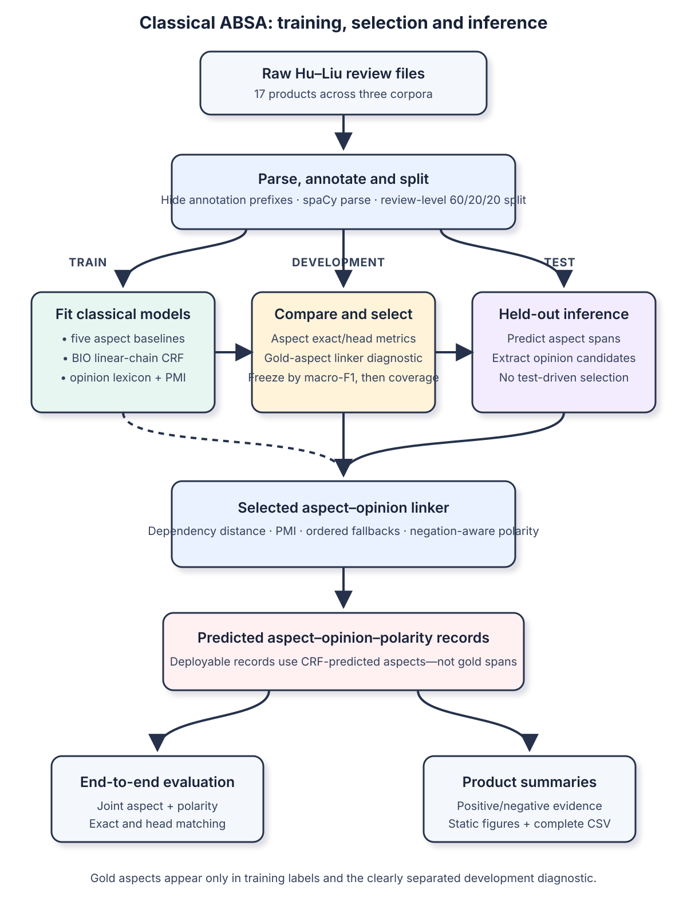

# Classical aspect-based sentiment analysis

How far can a transparent classical NLP pipeline get when it has to extract product aspects, attach opinion terms, assign polarity, and publish useful summaries?

This project rebuilds part of my MSc Artificial Intelligence coursework at the University of Bath as a reproducible, tested NLP engineering project. It retains a BIO linear-chain CRF, a weakly supervised opinion lexicon, dependency paths, and pointwise mutual information (PMI). The implementation now lives in a Python package with explicit train/development/test boundaries.

[Read the executed case-study notebook](notebooks/Classical_ABSA_Pipeline.ipynb).

## Results

The checked-in artifacts come from a seed-42 run over 3,267 parsed review units, 17 products or domains, and 5,775 non-neutral aspect labels.

| Evaluation | Split | Result |
|---|---:|---:|
| Best heuristic aspect baseline, exact F1 | development | 0.039 |
| BIO-CRF aspect extraction, exact F1 | development | 0.291 |
| BIO-CRF aspect extraction, exact F1 | test | 0.286 |
| Selected PMI linker, macro-F1 / coverage | development | 0.660 / 0.415 |
| Joint aspect-polarity F1, exact / head | test | 0.167 / 0.175 |
| Predicted aspects receiving a polarity link | test | 0.612 |

The run blanks each inline gold annotation prefix before linguistic processing, so the CRF cannot read the labelled aspect that appears before `##`. Only 74.6% of training labels align to an actual contiguous mention after that correction. The scores expose the effect of incomplete alignment and staged error propagation.



## What the package demonstrates

- Parsing three related but inconsistent Hu–Liu corpus layouts into typed records.
- Deterministic review-level 60/20/20 splits and train-fitted statistical state.
- Five linguistic/frequency aspect baselines plus BIO-CRF sequence labelling.
- Weakly supervised opinion polarity induction with a local negation rule.
- Dependency, PMI, dependency-to-PMI, and PMI-to-dependency linkers.
- Development-only model selection followed by held-out joint aspect-polarity evaluation.
- Atomic publication of aggregate CSVs, static figures, checksums, and a run manifest.
- A default test suite that uses fabricated reviews and needs neither network access nor private data.

## Design rationale

The corpus gives aspect polarity but not opinion spans or aspect--opinion links. The pipeline therefore separates the questions: a structured CRF predicts aspect spans; a training-fitted lexicon proposes opinion candidates; and explicit dependency/PMI linkers attach evidence. Gold aspects are used for training and the labelled linker diagnostic only. Product summaries use CRF-predicted aspects.

The main implementation is deliberately inspectable: [`data.py`](src/review_absa/data.py) handles offset-preserving annotation masking, [`aspects.py`](src/review_absa/aspects.py) builds BIO features and reports alignment, [`opinions.py`](src/review_absa/opinions.py) induces polarity, and [`linking.py`](src/review_absa/linking.py) makes deterministic attachment choices. Publication swaps the complete result directory so a reader never sees a mixture of runs.

## Evaluation boundary

The source corpora annotate aspect polarity, but not opinion spans or aspect–opinion pairs. Two evaluations therefore answer different questions:

1. **Linker component diagnostic.** Gold aspects are supplied explicitly, then coverage, polarity accuracy, and macro-F1 measure the opinion-linking stage in isolation. These rows are in [`artifacts/linking_metrics.csv`](artifacts/linking_metrics.csv).
2. **End-to-end inference.** CRF-predicted aspects are passed to the frozen linker. Joint `(aspect span, polarity)` precision, recall, and F1 are calculated on the test split. These rows are in [`artifacts/end_to_end_metrics.csv`](artifacts/end_to_end_metrics.csv).

The public product summaries use predicted aspects only. They are not generated by the gold-aspect diagnostic. The complete export is [`artifacts/product_summaries.csv`](artifacts/product_summaries.csv).

## Repository layout

```text
src/review_absa/       models, data boundaries, metrics and orchestration
tests/                 network-free unit and integration tests
notebooks/             one thin, executed case-study notebook
assets/                corrected pipeline architecture
artifacts/             aggregate CSVs, figures and the run manifest
data/README.md         source links and local data layout
```

The original coursework notebooks and utility files are not copied into this repository. Substantive implementation lives under `src/review_absa/`; the notebook reads aggregate artifacts and explains the evidence.

## Setup

Python 3.12 is required.

```bash
python3.12 -m venv .venv
source .venv/bin/activate
python -m pip install --upgrade pip
python -m pip install -e ".[dev]"
python -m pip install \
  https://github.com/explosion/spacy-models/releases/download/en_core_web_sm-3.8.0/en_core_web_sm-3.8.0-py3-none-any.whl
```

## Data

Raw reviews are not redistributed. Download the three official archives listed in [`data/README.md`](data/README.md), extract them locally, and use this directory layout:

```text
data/raw/
├── Customer_review_data/
├── Reviews-9-products/
└── CustomerReviews-3_domains/
```

Both `data/raw/` and `data/archives/` are ignored by Git.

## Reproduce the experiment

```bash
python -m review_absa.experiments \
  --data-dir data/raw \
  --output-dir artifacts \
  --seed 42
```

The command fits vocabularies, CRF, opinion lexicon, and PMI state on training data; compares candidates on development data; freezes the linker; evaluates test data; and publishes only after every table passes its schema and safety checks. [`artifacts/run_manifest.json`](artifacts/run_manifest.json) records settings, versions, data checksums, and artifact hashes without local paths or review identifiers.

To execute the narrative notebook:

```bash
jupyter nbconvert --execute --to notebook --inplace \
  --ExecutePreprocessor.timeout=120 \
  --ClearMetadataPreprocessor.enabled=True \
  --ClearMetadataPreprocessor.clear_notebook_metadata=False \
  notebooks/Classical_ABSA_Pipeline.ipynb
```

Run the network-free tests with:

```bash
python -m pytest -v -p no:cacheprovider
```

## Limitations

- Gold opinion spans and gold aspect–opinion links are unavailable, so triplet-level ASTE performance cannot be claimed.
- Roughly one quarter of training aspect labels do not align to a contiguous mention after annotation prefixes are hidden.
- The staged architecture propagates missed or fragmented CRF aspects into linking and summaries.
- PMI is selective: its better covered-case polarity score comes with lower gold-aspect coverage.
- Surface-form summaries can split semantically equivalent aspects, while review-level counts trade detail for resistance to repetition.
- The sentence-scoped linker does not resolve cross-sentence references or implicit aspects.

## Licence and data provenance

Code and documentation are MIT licensed. That licence does not cover the separately distributed review corpora. Follow the dataset authors' citation and usage guidance in [`data/README.md`](data/README.md).

## Selected references

- Hu and Liu, [*Mining and summarizing customer reviews* (KDD 2004)](https://www.cs.uic.edu/~liub/publications/kdd04-revSummary.pdf).
- Hu and Liu, [*Mining opinion features in customer reviews* (AAAI 2004)](https://www.cs.uic.edu/~liub/publications/aaai04-featureExtract.pdf).
- Lafferty, McCallum and Pereira, [*Conditional random fields* (2001)](https://www.cs.cmu.edu/~epxing/Class/10708-19/notes/10708_scribe_notes.pdf).
- Qiu et al., [*Opinion word expansion and target extraction* (ACL 2011)](https://aclanthology.org/J11-1002/).
- Pontiki et al., [*SemEval-2014 Task 4*](https://aclanthology.org/S14-2004/).
